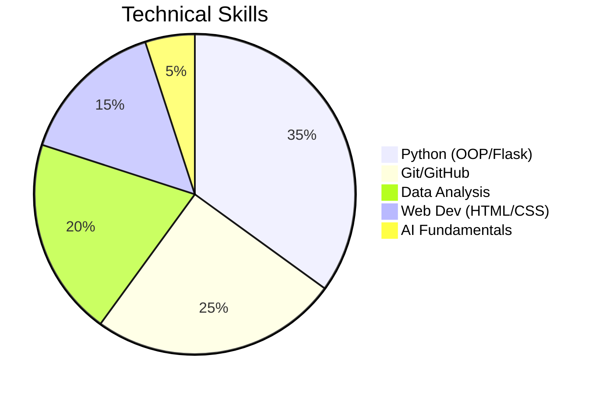
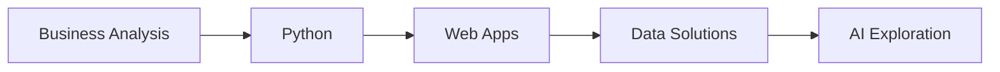

# Ahmed Elsayed Abdel-Al 👨‍💻

**Business Information Systems Student** | **Python Developer** | **Data Enthusiast**  

*"Turning complex problems into elegant solutions through code and data"*

---

## 🚀 Featured Projects

### 💻 Python Applications
- **[Library Management System](https://github.com/AhmedTyson/college-project-assignment-1/tree/main/Library%20Management%20System)** - OOP-based console app with dynamic menus and input validation  
- **[Car Loan Calculator](https://github.com/AhmedTyson/college-project-assignment-1/tree/main/Car%20Loan%20Calculator%20Application)** - Tkinter GUI with financial modeling (Interest rates, loan terms)  
- **[Talabat Console App](https://github.com/AhmedTyson/College-team-assignment-1)** - Food delivery simulator with cart management  

### 🌐 Web Development
- **[PETOPIA Adoption Platform](https://github.com/AhmedTyson/PETOBIA-student-activity-team-project)** - Responsive pet adoption site (HTML5/CSS3)  
- **[Personal Assistant Web App](https://github.com/Private-repo/.)** - Flask + GPT-3 chat (Weather/Calendar APIs)  

---

## 🔧 Tech Stack
**Languages**:  

**Frameworks**:  

**Tools**:  

---

## 📜 Certifications
| Certification                                 | Provider   | Skills Applied     | Badge                                                                                  |
| --------------------------------------------- | ---------- | ------------------ | -------------------------------------------------------------------------------------- |
| **[GitHub Foundations](https://www.datacamp.com/completed/statement-of-accomplishment/track/f1d16eb46190782bc484d441ab62c26be5a3b7b4)** | DataCamp   | Git, Collaboration |      |
| **[Python & Flask](https://www.ude.my/UC-853a36da-af1c-4bff-a5f6-4bc4b66a90e5)**                            | Udemy      | OOP, Web Dev       |    |
| **[AI Essentials](https://intranet.alxswe.com/certificates/NFzyxYreET)**                             | alx_africa | Data Visualization |            |
| **[Excel Advanced](https://ude.my/UC-eac85e19-e391-4906-9404-8439b955c85d)**                            | Udemy      | Data Analysis      |  |
|                                               |            |                    |                                                                                        |
|                                               |            |                    |                                                                                        |

---

## 📊 Skills Breakdown

**Key Strengths**:
- ✔ Backend Development: Built 4+ Flask apps with PostgreSQL  
- ✔ Data Wizardry: Advanced Excel formulas + SAS-certified analysis  
- ✔ AI Exploration: Implemented GPT-3 chat in team projects  

---

## 📬 Contact Me

- 💼 **LinkedIn**: [Ahmed Elsayed](https://www.linkedin.com/in/ahmed-elsayed-8b9bba28a/)  
- 🐱 **GitHub**: [@AhmedTyson](https://github.com/AhmedTyson)  

---

## 🌱 Growth Track
**Currently Learning**:  
- Django for scalable web apps  
- Docker for deployment  
- Advanced data visualization (Power BI)  

**2025 Goals**:  
- AWS Cloud Practitioner Certification  
- Contribute to open-source projects  

---

⚡ **Fun Fact**:  
When not coding, I analyze football stats ⚽ or experiment with fintech tools!  

