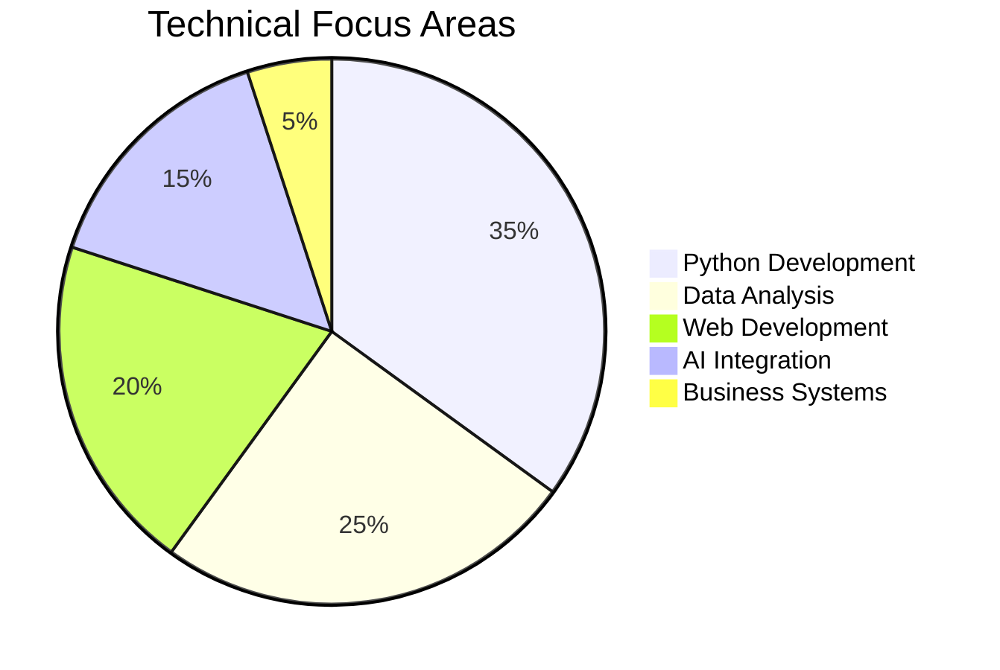

# ✨ Ahmed Elsayed Abdel-Al

**`Digital Alchemist`** (Business Information Systems | Python Developer | Data Explorer)

  

---

  
  

---

<picture>
  <source media="(prefers-color-scheme: dark)" srcset="https://raw.githubusercontent.com/AhmedTyson/AhmedTyson/output/github-snake-dark.svg" />
  <source media="(prefers-color-scheme: light)" srcset="https://raw.githubusercontent.com/AhmedTyson/AhmedTyson/output/github-snake.svg" />
  
</picture>

---

## 🛠️ Technical Arsenal

### **Core Stack**

  
  
  
  
  
  
  
  
  
  
  
  
  

---

## 🏆 Certifications

| Certification                                                                                                                           | Provider   | Skills Applied     | Badge                                                                                                                                                                                                                                              |
| --------------------------------------------------------------------------------------------------------------------------------------- | ---------- | ------------------ | -------------------------------------------------------------------------------------------------------------------------------------------------------------------------------------------------------------------------------------------------- |
| **[GitHub Foundations](https://www.datacamp.com/completed/statement-of-accomplishment/track/f1d16eb46190782bc484d441ab62c26be5a3b7b4)** | DataCamp   | Git, Collaboration |  |
| **[Python & Flask](https://www.ude.my/UC-853a36da-af1c-4bff-a5f6-4bc4b66a90e5)**                                                        | Udemy      | OOP, Web Dev       |                                                                                                                                                                |
| **[AI Essentials](https://intranet.alxswe.com/certificates/NFzyxYreET)**                                                                | alx_africa | Data Visualization |                                                                                                                                                                        |
| **[Excel Advanced](https://ude.my/UC-eac85e19-e391-4906-9404-8439b955c85d)**                                                            | Udemy      | Data Analysis      |                                                                                                                                                              |

---

## 🚀 Project Showcase

### **Python Excellence**

| Project                                                                                                                               | Description                 | Tech            |
| ------------------------------------------------------------------------------------------------------------------------------------- | --------------------------- | --------------- |
| **[Library Management System](https://github.com/AhmedTyson/college-project-assignment-1/tree/main/Library%20Management%20System)**   | OOP-based management system | Python, OOP     |
| **[Car Loan Calculator](https://github.com/AhmedTyson/college-project-assignment-1/tree/main/Car%20Loan%20Calculator%20Application)** | Financial modeling GUI      | Tkinter, Python |
| **[Talabat Application](https://github.com/AhmedTyson/College-team-assignment-1)**                                                    | Food delivery simulator     | Python, CLI     |

### **Web Wizardry**

| Project                                                                            | Description           | Tech         |
| ---------------------------------------------------------------------------------- | --------------------- | ------------ |
| **[PETOPIA](https://github.com/AhmedTyson/PETOBIA-student-activity-team-project)** | Pet adoption platform | HTML5, CSS3  |
| **[Personal Assistant](https://github.com/AhmedTyson/Personal-Assistance-ItI---Python-)**                                                             | AI-powered web app    | Flask, GPT-3 |

---

## 📊 Skills Matrix

---

## 🌟 Special Sauce

**What makes my work unique:**

- 🧠 **AI-Augmented Development**: Leveraging ChatGPT for code optimization and DeepSeek for complex problem solving
- 📈 **Data-Driven Mindset**: Combining business analysis with technical implementation
- 🎯 **Precision Engineering**: Clean, maintainable code with thorough documentation

---

---

  <em>"When not coding, you'll find me analyzing football stats ⚽ or exploring fintech innovations 💳"</em>

