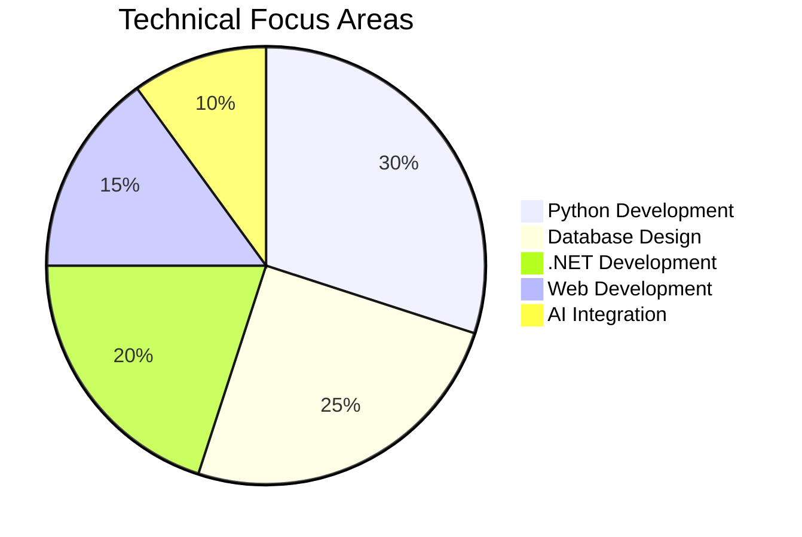

# ✨ Ahmed Elsayed Abdel-Al

## 🧪 `Digital Alchemist` 

**Full Stack .NET Developer | Python Developer | Database Architect**
*Business Information Systems · Data Explorer · AI-Augmented Solutions*

  
  

## 🧑💻 About Me

Business Information Systems undergraduate (*GPA: 3.58*) with a passion for building secure, data-driven applications. Experienced across the full stack: **C#/.NET**, **Python/Flask**, modern SQL, responsive web front-ends, and AI integration.

- 🎓 **B.BIS**, Helwan University (2023–2027, GPA 3.58)
- 🎯 Aspiring **.NET Full Stack Developer** building enterprise solutions with C\#, ASP.NET Core, SQL Server, and AI.
- 🔥 Passions: Security-first design, relational modeling, cosmic UX.

---

  <h2>🚀 Code • Create • Inspire</h2>
  <h3>Turning Passion into Digital Reality</h3>
  
  <table>
    <tr>
      <td>
        
      </td>
      <td>
        
      </td>
    </tr>
    <tr>
      <td colspan="2" align="center">
        
      </td>
    </tr>
  </table>
  
   
  
  

    
  

  
   
  
  

            
    
  

---

<picture>
  <source media="(prefers-color-scheme: dark)" srcset="https://raw.githubusercontent.com/AhmedTyson/AhmedTyson/output/github-snake-dark.svg" />
  <source media="(prefers-color-scheme: light)" srcset="https://raw.githubusercontent.com/AhmedTyson/AhmedTyson/output/github-snake.svg" />
  
</picture>

---

## 🛠️ Technical Arsenal

### **Core Stack**

  
  
  
  
  
  
  
  
  
  
  
  
  
  

---

## 🚀 Project Showcase

| Project | Highlights | Year |
| :-- | :-- | :-- |
| **[JavaNova Academy](https://github.com/AhmedTyson/JavaNova-project)** | Cosmic Java learning platform: 4-theme engine, starfield UX, interactive cursor, 5-step framework | 2025 |
| **Port-folio Website**   | Personal portfolio responsive: HTML5, CSS3, JS               | 2025 |
| **[CollegeDB](https://github.com/AhmedTyson/Tasks/tree/5fabb8566da3bfd5edfabfb3f81f748f347b8c3b/1.%20SQL%20Tasks/CollegeDB%20project-%20Task%205)** | Enterprise college management: 9 tables, 11 FK, 4-level RBAC, optimized SPs, full ERD | 2025 |
| **[Sierra ILS Library Management System](https://github.com/AhmedTyson/college-project-assignment-1/tree/main/Library%20Management%20System)** | OOP library system: SOLID patterns, validation, error handling | 2025 |
| **[Car Loan Calculator](https://github.com/AhmedTyson/college-project-assignment-1/tree/main/Car%20Loan%20Calculator%20Application)** | Real-time amortization GUI using Tkinter | 2025 |
| **[Pet Adoption Website (PETOPIA)](https://github.com/AhmedTyson/PETOBIA-student-activity-team-project)** | Responsive pet adoption website (HTML5, CSS3, mobile-first) | 2025 |
| **[Personal Assistant Web App](https://github.com/AhmedTyson/Personal-Assistance-ItI---Python-)** | GPT-3 powered web assistant with auth \& REST APIs | 2024 |
| **[Talabat CLI Simulator](https://github.com/AhmedTyson/College-team-assignment-1)** | Command-line food delivery simulation | 2024 |

---

## 📊 Skills Matrix

---

## 🌟 Unique Value \& Style

- 🧠 **ENTP Visionary**: Rapid ideation, fearless experimentation, and iterative delivery.
- 🛡️ **Security-First**: RBAC, parameterized queries, layered architecture by design.
- 🗺️ **Data Modeling Maestro**: High-performance schemas and clear ERDs.
- 🎯 **Precision Engineer**: Clean, maintainable code with exhaustive documentation.

---

## 🏆 Certifications

| Certification                                                                                                                           | Provider   | Skills Applied     | Badge                                                                                                                                                                                                                                              |
| --------------------------------------------------------------------------------------------------------------------------------------- | ---------- | ------------------ | -------------------------------------------------------------------------------------------------------------------------------------------------------------------------------------------------------------------------------------------------- |
| **[GitHub Foundations](https://www.datacamp.com/completed/statement-of-accomplishment/track/f1d16eb46190782bc484d441ab62c26be5a3b7b4)** | DataCamp   | Git, Collaboration |  |
| **[Python & Flask](https://www.ude.my/UC-853a36da-af1c-4bff-a5f6-4bc4b66a90e5)**                                                        | Udemy      | OOP, Web Dev       |                                                                                                                                                                |
| **[AI Essentials](https://intranet.alxswe.com/certificates/NFzyxYreET)**                                                                | alx_africa | Data Visualization |                                                                                                                                                                        |
| **[Excel Advanced](https://ude.my/UC-eac85e19-e391-4906-9404-8439b955c85d)**                                                            | Udemy      | Data Analysis      |                                                                                                                                                              |

---

## 🙌 Let’s Connect

  
  
  

---

 
  <em>"When not coding, you'll find me analyzing football stats ⚽ or architecting database solutions 💾"
  </em> 

