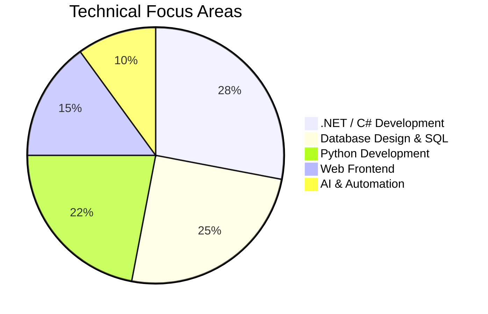

# ✨ Ahmed Elsayed Abdel-Al

## 🔮 `Digital Alchemist`

**Full Stack .NET Developer | Python Developer | Database Architect**
_Business Information Systems · Data Explorer · AI-Augmented Solutions_

---

## 💻 About Me

Business Information Systems undergraduate (_GPA: 3.58_) with a passion for building secure, data-driven applications. Experienced across the full stack: **C#/.NET**, **Python/Flask**, modern SQL, responsive web front-ends, and AI integration.

- 🎓 **B.BIS**, Helwan University (2023–2027, GPA 3.58)
- 🎯 Aspiring **.NET Full Stack Developer** building enterprise solutions with C\#, ASP.NET Core, SQL Server, and AI.
- 🔥 Passions: Security-first design, relational modeling, cosmic UX.

---

## 🚀 Cosmic Achievements

  <table>
    <tr>
      <td>
        
      </td>
      <td>
        
      </td>
    </tr>
    <tr>
      <td colspan="2" align="center">
        
      </td>
    </tr>
  </table>

 

  

 

        
    

---

<picture>
  <source media="(prefers-color-scheme: dark)" srcset="https://raw.githubusercontent.com/AhmedTyson/AhmedTyson/output/github-snake-dark.svg" />
  <source media="(prefers-color-scheme: light)" srcset="https://raw.githubusercontent.com/AhmedTyson/AhmedTyson/output/github-snake.svg" />
  
</picture>

---

## 🌟 Cosmic Value Proposition

  <table>
    <tr>
      <td width="33%" align="center">
        <h3>🧠 ENTP Visionary</h3>
        
Rapid ideation • Fearless experimentation • Iterative delivery

      </td>
      <td width="33%" align="center">
        <h3>🛡️ Security-First Architect</h3>
        
RBAC systems • Parameterized queries • Layered architecture

      </td>
      <td width="33%" align="center">
        <h3>🗺️ Data Modeling Maestro</h3>
        
High-performance schemas • Clear ERDs • Optimized queries

      </td>
    </tr>
    <tr>
      <td width="33%" align="center">
        <h3>🎯 Precision Engineer</h3>
        
Clean maintainable code • Exhaustive documentation • SOLID principles

      </td>
      <td width="33%" align="center">
        <h3>🚀 Full Stack Navigator</h3>
        
.NET Core to Vanilla JS • SQL to NoSQL • Cloud to Edge

      </td>
      <td width="33%" align="center">
        <h3>🤖 AI Augmenter</h3>
        
LLM integration • Data augmentation • Intelligent automation

      </td>
    </tr>
  </table>

---

## 🛠️ Technical Arsenal

### **Core Stack**

  
  
  
  
  
  
  
  
  
  
  
  
  
  
  

---

## 🚀 Project Showcase

### 🏆 Flagship Projects

| Project                                                                                                         | Stack                          | Highlights                                                                                                                | Year |
| :-------------------------------------------------------------------------------------------------------------- | :----------------------------- | :------------------------------------------------------------------------------------------------------------------------ | :--- |
| **[Tafsilk](https://github.com/AhmedTyson/Tafsilk)** · [🌐 Live](https://tafsilk.runasp.net)                    | ASP.NET Core · C# · SQL Server | Multi-role e-commerce: Admin/Seller/Buyer RBAC, Stripe payments, Google OAuth, Entity Framework Core, repository pattern  | 2025 |
| **[BIS Schedule Search](https://github.com/AhmedTyson/bis-schedule)**                                           | Vanilla JS · PWA · Netlify     | Bilingual (AR/EN) schedule search: off-thread Fuse.js Web Worker, zero build step, 8,800+ bytes of ES Module architecture | 2025 |
| **[CollegeDB](https://github.com/AhmedTyson/Tasks/tree/main/1.%20SQL%20Tasks/CollegeDB%20project-%20Task%205)** | SQL Server · T-SQL             | Enterprise college schema: 9 tables, 11 FK, 4-level RBAC, optimized stored procedures, full ERD                           | 2025 |

### 🌐 Web & Frontend

| Project                                                                                                                                         | Stack                    | Highlights                                                                                      | Year |
| :---------------------------------------------------------------------------------------------------------------------------------------------- | :----------------------- | :---------------------------------------------------------------------------------------------- | :--- |
| **[JavaNova Academy](https://github.com/AhmedTyson/JavaNova-project)** · [🌐 Live](https://ahmedtyson.github.io/JavaNova-project/javanova.html) | HTML · CSS · JS          | Space-themed Java academy: 4-theme engine, animated starfield, 5-step interactive framework     | 2025 |
| **[BIS E-Commerce Frontend](https://github.com/AhmedTyson/BIS_Ecommerce_Frontend_project)**                                                     | HTML · CSS · JS          | Dual-store frontend: Harizon mobile retail + Gourmet Haven restaurant, multi-page vanilla sites | 2025 |
| **[PETOPIA Pet Adoption](https://github.com/AhmedTyson/PETOBIA-student-activity-team-project)**                                                 | HTML · CSS               | Responsive pet adoption website: 7-page site, mobile-first layout, team collaboration           | 2025 |
| **[Artistic Workshop](https://github.com/AhmedTyson/artistic-project)**                                                                         | HTML · CSS               | Multi-page art studio website: products, workshops, booking, and contact                        | 2025 |
| **[Bootstrap Storefront](https://github.com/AhmedTyson/bootstrap-starter)**                                                                     | HTML · CSS · Bootstrap 5 | Ceramic product store template: Bootstrap grid, cards, pagination, zero dependencies            | 2025 |

### 🐍 Python & Backend

| Project                                                                                                                               | Stack                   | Highlights                                                                                            | Year |
| :------------------------------------------------------------------------------------------------------------------------------------ | :---------------------- | :---------------------------------------------------------------------------------------------------- | :--- |
| **[Personal Assistant Web App](https://github.com/AhmedTyson/Personal-Assistance-ItI---Python-)**                                     | Python · Flask · Jinja2 | ITI capstone: Sierra ILS library management, Flask Blueprints, Jinja2 templates, test suite           | 2024 |
| **[Sierra ILS Library System](https://github.com/AhmedTyson/college-project-assignment-1/tree/main/Library%20Management%20System)**   | Python · OOP            | Console library management: Book/EBook inheritance, menu-driven CRUD, SOLID patterns                  | 2025 |
| **[Car Loan Calculator](https://github.com/AhmedTyson/college-project-assignment-1/tree/main/Car%20Loan%20Calculator%20Application)** | Python · Tkinter        | Real-time amortization GUI: automatic interest rates, input validation, monthly payment formula       | 2025 |
| **[Talabat CLI Simulator](https://github.com/AhmedTyson/College-team-assignment-1)**                                                  | Python · OOP            | Food delivery console sim: user registration, cart management, receipt generation, session continuity | 2024 |

### ⚡ Automation & Tooling

| Project                                                                              | Stack                                     | Highlights                                                                                       | Year |
| :----------------------------------------------------------------------------------- | :---------------------------------------- | :----------------------------------------------------------------------------------------------- | :--- |
| **[Telegram × Google Drive Bot](https://github.com/AhmedTyson/Telegrambot-node.js)** | Node.js · Telegram API · Google Drive API | Cloud automation bot: upload/retrieve/list Drive files directly from Telegram chat via OAuth 2.0 | 2024 |
| **[Checklist Application](https://github.com/AhmedTyson/checklist-application)**     | Vanilla JS · ES Modules · Node.js         | Structured JS learning project: ES Module architecture, admin panel, no bundler required         | 2024 |

### 📚 Knowledge & Reference

| Project                                            | Description                                                                                            | Year |
| :------------------------------------------------- | :----------------------------------------------------------------------------------------------------- | :--- |
| **[Guides](https://github.com/AhmedTyson/Guides)** | Technical reference library: bilingual Git/GitHub roadmap (AR+EN), vibe coding guide, CV writing guide | 2025 |
| **[Tasks](https://github.com/AhmedTyson/Tasks)**   | Learning archive: 7 SQL tasks (incl. enterprise CollegeDB), 6 C# OOP assignments, DEPI schedule        | 2025 |

---

## 📊 Skills Matrix

---

## 🏆 Certifications

| Certification                                                                                                                           | Provider   | Skills Applied     | Badge                                                                                                                                                                                                                                              |
| :-------------------------------------------------------------------------------------------------------------------------------------- | :--------- | :----------------- | :------------------------------------------------------------------------------------------------------------------------------------------------------------------------------------------------------------------------------------------------- |
| **[GitHub Foundations](https://www.datacamp.com/completed/statement-of-accomplishment/track/f1d16eb46190782bc484d441ab62c26be5a3b7b4)** | DataCamp   | Git, Collaboration |  |
| **[Python & Flask](https://www.ude.my/UC-853a36da-af1c-4bff-a5f6-4bc4b66a90e5)**                                                        | Udemy      | OOP, Web Dev       |                                                                                                                                                                |
| **[AI Essentials](https://intranet.alxswe.com/certificates/NFzyxYreET)**                                                                | alx_africa | Data Visualization |                                                                                                                                                                        |
| **[Excel Advanced](https://ude.my/UC-eac85e19-e391-4906-9404-8439b955c85d)**                                                            | Udemy      | Data Analysis      |                                                                                                                                                              |

---

## 🙌 Let's Connect

  
  
  

---

  <em>"When not coding, you'll find me analyzing football stats ⚽ or architecting database solutions 💾"</em>

 

  

